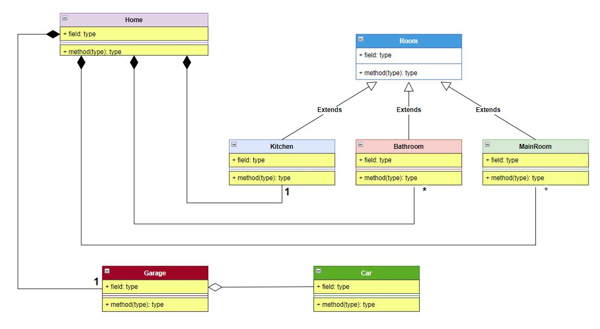
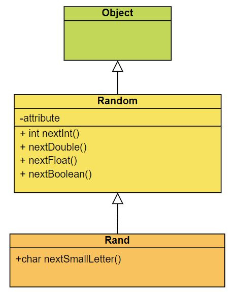

# java-oop-uml
A friendly introduction to Object Oriented Programming with Java and using UML class diagram. It is not a beginning tutorial about Java programming fundamentals, or about how setup your projects, packages, working with files, etc. If you need any refreshment or if you are new to programming or new to Java language, please consider review [my repo "java-essentials"](https://github.com/anmarjarjees/java-essentials).

# Objects
- Anything in our life is an object. Example from our real life: anything can be an object like a dog, a cat, a car, a pen, etc...

- Object is the foundation of Object Oriented Programming

- In real world,  an architect uses "blueprint" to create identical buildings, houses, cars, etc..
    - Classes (Blueprint) and Objects (samples from the blueprint)
    - Class is like a template for creating objects
    - Class is used by programmer to recreate an object and its functions repeatedly

- object is an instance of class.

- Any object like a dog can have:
    - characteristics (color, age, name, etc)
    - actions (verbs) (sleep, run, etc...)

- In the programming language any object like a dog can have:
    - (attributes/properties/fields) in Programming => similar to characteristics (specifications) in our life
    - methods (functions) in Programming => similar to actions/behaviour in our life

- Object Encapsulation:
It's simply to put all the object's member into a one single container to make our software clean. Things will separated into isolated section and not mixed together. 

For example:
an object named "student" has all its characteristics and actions (members) separated from another object named "instructor". In OOP, each object has its own related data (fields) and methods (function) all in a single component.

Encapsulation term is the idea of specifying how can we access a class members.

# Design Pattern (Architecture):
In Java or any other OOP language, we can build High level Object Oriented Architectures, by applying concepts of OOP (A PIE):
- Abstraction and Interfaces
- Polymorphism
- Inheritance
- Encapsulation 

# Static Keyword
The keyword "static" which means fixed in English
In OOP it means this member (field or method) is fixed to a class
and it CANNOT be used/modified/accessed/invoked by the class instance.
In other words, if we set a method to be static, it means this method 
can be called and triggered within its class without creating an object.

The "main()" method is always and needs to be "static" 
because it's the starting entry point for our Java program/application,
As at the beginning, there are no instances/objects have been created for a class. 

# Inheritance
Subclass extends a superclass like a child extends the parent. We use the keyword "extends" to build new classes that are built upon existing classes.

# Unified Modeling Language:
In Unified Modeling Language, we will be focusing on Class Diagram:
Please refer to my UML pdf files for more clarification
- Classes and object are represented in Boxes
- Different kinds of connections between classes depending on the relationship:
    - Inheritance => is-A relationship => Arrow
    - Composition => has-A relationship:
        - Hallow Diamond Headed Arrow = 
        - Filled Diamond Headed Arrow = to signify a tighter relationship (ownership) like engine in the car, a room in the house

# Types of relationship:
Quick idea about relationships explained in this article "[UML Association vs Aggregation vs Composition]"(https://www.visual-paradigm.com/guide/uml-unified-modeling-language/uml-aggregation-vs-composition/):
- Owners feed pets, pets please owners (association)
- A tail is a part of both dogs and cats (aggregation / composition)
- A cat is a kind of pet (inheritance / generalization)

# UML Diagram
Examine this UML Diagram that describes the relationship between these Objects/Classes:
- House
- Room
    - Kitchen
    - Bathroom
    - Bedroom
- Garage
    - Car

Implementing the diagram
- House Object
- Room Object is superclass of these objects
    - Kitchen extends Room
    - Bathroom extends Room
    - Bedroom extends Room

Now all these objects:
- Kitchen
- Bathroom
- Bedroom 
can NOT be exist outside or without a house, so they have the composition relationship with the house, In other words, they have a deeper connection with the house object so we use the shaded/filled diamond to connect them all with the house.

Look at the symbols:
House can have:
- one kitchen (Yes, in one floor) => 1 
- multiple bathroom => *
- multiple bedroom => *
- garage "Garage object" => 1

Finally the "Car" object is inside the Garage but it can also exists outside the garage and it's not deep connected with the garage so we can use the empty diamond the represents the "Aggregation":

# UML Diagram Build and Design:
You can create a UML class diagram to show a static view of a system's classes, their attributes and methods, and the relationships among objects. It gives an overview of an application. 
You can create and edit UML diagrams using:
- [Visio](https://support.microsoft.com/en-us/office/create-a-uml-class-diagram-de6be927-8a7b-4a79-ae63-90da8f1a8a6b#OfficeVersion=Web)
- [Visual Paradigm](https://www.visual-paradigm.com/). This is the one that I personally used with my classmates when I was studying for my certificate in Systems Analysis at Centennial College. We used the Desktop version and it was powerful.

# Packages
To make types easier to find and use, to avoid naming conflicts, and to control access, programmers bundle groups of related types into packages. A package is a grouping of related types providing access protection and name space management. You can check this Oracle tutorial about ["Creating and Using Packages"](https://docs.oracle.com/javase/tutorial/java/package/packages.html)

# Packages Naming Conventions
Package names are written in all lower case to avoid conflict with the names of classes or interfaces.

Companies use their reversed Internet domain name to begin their package names — for example, com.example.mypackage for a package named mypackage created by a programmer at example.com.

Packages in the Java language itself begin with java. or javax.

## Using Package Members
The types that comprise a package are known as the package members.
To use a public package member from outside its package, you must do one of the following:

- Refer to the member by its fully qualified name
- Import the package member
- Import the member's entire package
- Each is appropriate for different situations

Example1: import the Rectangle class from the graphics package
> import graphics.Rectangle;

Example2: import all the types contained in a particular package
> import graphics.*;

You can learn more from this Oracle doc ["Using Package Members"](https://docs.oracle.com/javase/tutorial/java/package/usepkgs.html)

# Packages and Classes
Please follow this order of the packages to learn the concepts step by step:
- p01_classes
    - User.java (the anatomy of a class)
    - Car.java (working with the Constructor method)
    - Person.java (working with the Constructor method)
    - Main.java
- p02_classes_exercise
    - CatGame.java
    - Superman.java
- p03_encapsulation
    - User.java
    - Main.java
    - Member.java
    - Account.java
- p04_static_keyword
    - User
    - Main
    - Dog
    - Final

- junit_test
    - to be added ("Test Runner for Java" from Microsoft is needed)

look at the diagram below that shows the inheritance relationship:
 - Our custom class "Rand" inherit from Java Class "Random"
But what about "Object" class? 
- In Java the class "Object" is the mother of all the builtin objects of Java
- Classes might not directly extends or inherits from "Object" but still "Object" is the main (root) ancestor 
- It's the only class that doesn't extend another class (doesn't inherit from another class)

# Inheritance:
Continue the code files:

- p05_inheritance1
    - Main
    - Random
- p06_inheritance2
    - Vehicle.java
    - Car.java
    - Main.java
    - Employee.java

# Polymorphism:
Many forms. Continue the code files:

- p07_polymorphism
    - Perimeter.java
    - Shape.java
    - Rectangle.java
    - Square.java
    - Triangle.java
    - Main.java

# Interfaces:
Continue the code files:
- p08_interface
    - PaymentCalculator.java
    - JuniorLevel.java
    - SeniorLevel.java
    - Main.java

# Resources, References, and Credits:
- "June Clarke": Software Engineer and Java Instructor at UC San Diego University
You can check [June Clarke GitHUb](https://github.com/joonspoon), and her own code examples about OOP with Java are can be found in this repo [this repo](https://github.com/joonspoon/madecraft-oop)

- Java How to Program, 11/e, Early Objects Version by [Paul Deitel (Author)] (https://deitel.com/about/), Harvey Deitel (Author):

- CORE Java Volume 1: Fundamentals by [Cay S. Horstmann](https://horstmann.com/)

    

